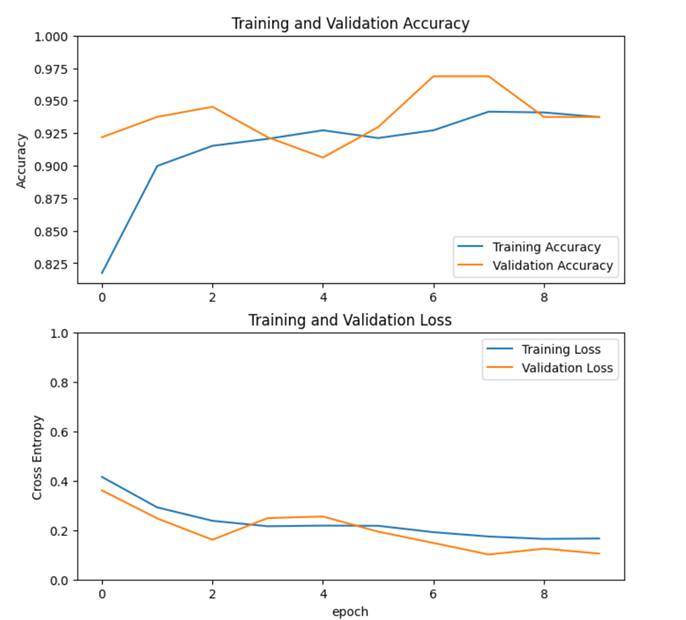
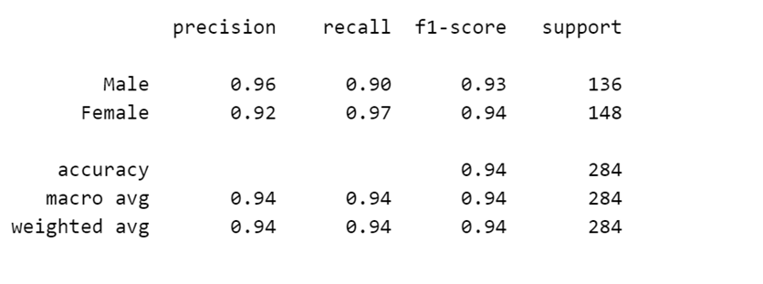
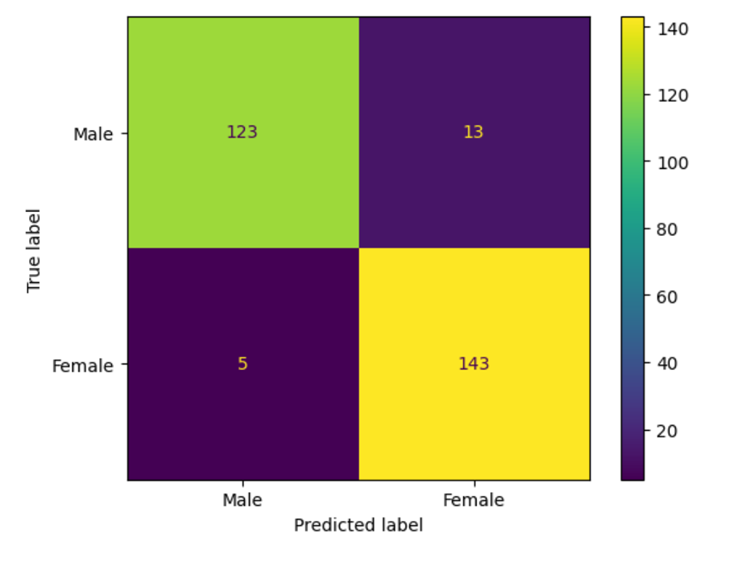
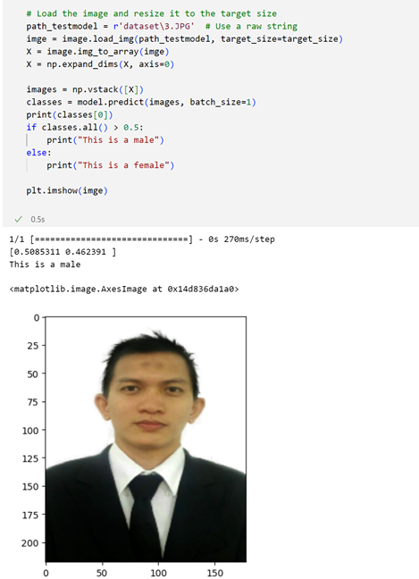

# Introduction
Gender classification  refers to the task of automatically identifying the gender (male or female) of individuals based on various inputs, typically images. It is a common application of machine learning and computer vision techniques.

# Getting Started

1. Dataset Preparation:
Obtain a dataset with images labeled with gender (male or female).
Split the dataset into training and testing sets.

2. Software and Library Setup:
Install the required software and libraries: Python, TensorFlow, Keras, and other dependencies.
Import the necessary libraries in your Python script or notebook.

3. Data Preprocessing:
Load and preprocess the images from the dataset.
Resize the images to a specific size .
Normalize the pixel values to a range between 0 and 1.

4. Data Augmentation:

Apply data augmentation techniques to increase the diversity of the training data and improve model generalization.
Common augmentation techniques include random flips, rotations, zooming, and image transformations.

5. Model Creation:
Import the ResNet model architecture from the chosen deep learning framework (e.g., Keras, TensorFlow).
Remove the top layers (fully connected layers) of the pre-trained ResNet model.
Add new layers suitable for gender classification, such as fully connected layers with the desired number of units or a global average pooling layer.

6. Model Compilation:
Compile the model by specifying the loss function (e.g., binary cross-entropy), optimizer (e.g., Adam), and evaluation metrics (e.g., accuracy).
Model Training:

7. Feed the preprocessed training data into the model.
Specify the number of epochs (iterations over the entire training dataset), batch size, and any other relevant parameters.
Monitor the training process and evaluate the model's performance on validation data during training.
Adjust the model architecture or hyperparameters as needed to improve performance.

8. Model Evaluation:
Evaluate the trained model on the testing dataset.
Calculate metrics such as accuracy, precision, recall, and F1 score to assess the model's performance.

9. Model Prediction:
Use the trained model to predict the gender of new, unseen images.
Preprocess the new images using the same steps as the training and testing data.
Pass the preprocessed images through the trained model and interpret the predictions.

10. Fine-tuning and Further Improvements:
If the model's performance is not satisfactory, consider fine-tuning the hyperparameters or model architecture.
Experiment with different learning rates, optimizers, activation functions, or regularization techniques.
Perform additional data augmentation or explore advanced techniques like transfer learning.

# Dataset
https://www.kaggle.com/datasets/jessicali9530/celeba-dataset

# Training and Validation

# Accuration

# Confusion Matrix

# Testing_Result

