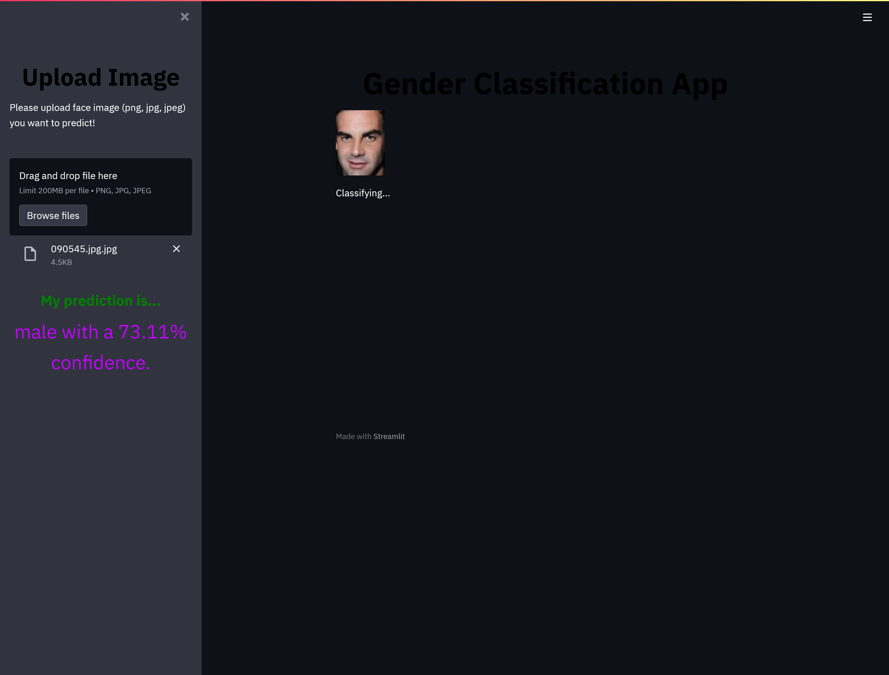

# About
Gender recognition web application using cnn model. Dataset and model were collected and trained by myself feel free to download them bellow:

# Dataset
https://www.kaggle.com/maciejgronczynski/biggest-genderface-recognition-dataset

# Model
https://www.kaggle.com/maciejgronczynski/cnn-sequential-gender-recognition-model

# App link
https://share.streamlit.io/cl500coupe/gender_recognition_app/main/app.py

# Input

# Output

